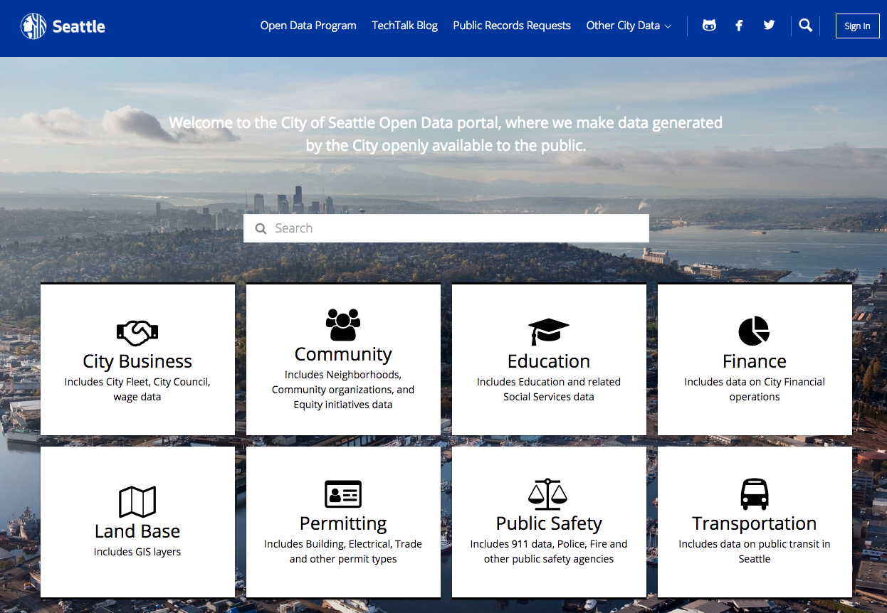
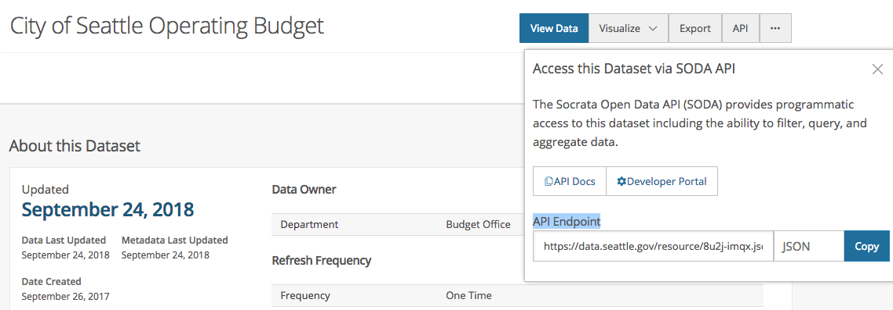
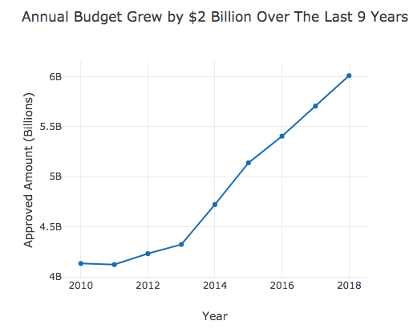

# 3 Tips For Connecting To Your First API
## Seattle Open City Data



In the Plotly_Open_City_Data_API notebook, we'll connect to a few open datasets for Seattle (https://data.seattle.gov) using the Socrata Open Data (SODA) API. We'll cover filtering and querying with the SODA API, and then visualize the results. In the web_app_plotly folder, you'll
see the code needed to deploy these visualizations to a Heroku web app, which you can check out at https://pmaag-webapp.herokuapp.com/.

## 1. How To Find The API Endpoint



To grab the API endpoint, first navigate to a sample dataset that you're interesting in exploring. We'll use https://data.seattle.gov/dataset/City-of-Seattle-Operating-Budget/8u2j-imqx as an example. Then, in the upper right corner, click on the API button and copy the text in the API Endpoint box: https://data.seattle.gov/resource/8u2j-imqx.json. Several cities use Socrata, but if you're using a different API, your best best is to skim through the documentation for details.

## Imports

```python
import pandas as pd
import requests
import matplotlib.pyplot as plt

%matplotlib inline
```

## 2. Create A Function To Simplify Bringing In The Data

For ease of use, we will create a function utilizing the requests library where we can pass a url and an optional set of query parameters and then convert the result into a pandas dataframe.

```python
def open_data_to_df(url, params=None):
    """ Input url and convert to pandas dataframe"""
    request_object = requests.get(url, params)
    request_object_json = request_object.json()
    return pd.DataFrame([entry for entry in request_object_json])
```

## 3. Multiple Ways To Filter SODA API Results
- **Simple Filters**: https://dev.socrata.com/docs/filtering.html
- **Payload**: Variation on simple filters that separates filters into an easily readable dictionary http://docs.python-requests.org/en/master/user/quickstart/
- **Socrata Query Language (SoQL)**: https://dev.socrata.com/docs/queries/

Honestly, the documentation linked above could use more code examples, but with a little trial and error and reading the rest of this post, you should be able to quickly understand how to filter the results. Keep in mind that the default limit for queries is set to 1000, but we can adjust this up to 50,000 before we need to worry about paging ( https://dev.socrata.com/consumers/getting-started.html ).

### Simple Filters Example

One way to filter the results is by adding ```?<column_name>=<value>``` to the end of the URL. If you would like to filter on more than one column, separate each column with an ampersand like this: ```?<col_1>=<val_1>&<col_2>=<val_2>```.

```python
simple_budget_url = 'https://data.seattle.gov/resource/4fzy-5niz.json?fiscal_year=2018&department=Transportation'
simple_budget = open_data_to_df(simple_budget_url)
```

### Payload Example

Another way is to separate the filter in a dictionary, and then pass that dictionary to ```requests.get```. In the below example, the function open_data_to_df takes a params parameter where we can pass the dictionary. If you have several values you would like to filter on, this variation can make it easier to keep track of compared to a very long string if we used the simple filter technique.

```python
# Enter column name followed by value into payload dictionary for filtering
payload = {'fiscal_year': '2018', 'department': 'City Light'}
budget_url = 'https://data.seattle.gov/resource/4fzy-5niz.json'

# Pass the payload as the second argument to the function
budget_using_payload = open_data_to_df(budget_url, params=payload)
```

### Socrata Query Language (SoQL) Example

If you're familiar with SQL, you can use most of its functionality to quickly shape the data. Below we will walk through an example of the syntax. To use SoQL with the SODA API, we just need to append ```$<sql_query>``` at the end of the URL.

Example Query: <br>
**select** fiscal_year, sum(approved_amount) as approved_amount <br>
**where** fiscal_year between 2010 and 2018 <br>
**group by** fiscal_year <br>
**order by** fiscal_year

```python
# Note the '=' directly after the SELECT. Without that, the API returns an error
yearly_budget_url = 'https://data.seattle.gov/resource/4fzy-5niz.json?$select=fiscal_year, \
                     sum(approved_amount) as approved_amount \
                     where fiscal_year between 2010 and 2018  \
                     group by fiscal_year \
                     order by fiscal_year'
yearly_budget = open_data_to_df(yearly_budget_url)

# Convert approved_amount from string to numeric
yearly_budget['approved_amount'] = pd.to_numeric(yearly_budget['approved_amount'])
```

# Dive Into The Data

For more data examples, please see the notebook referenced earlier.

## How Has Seattle's Overall Budget Grown Over The Last Several Years?


