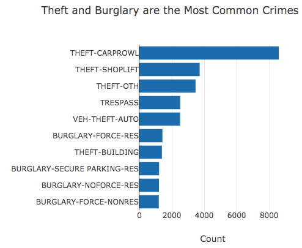

# 3 Tips For Connecting To Your First API
## Seattle Open City Data

## Packages

The Jupyter notebook for this project utilizes requests, pandas, and matplotlib from Python. The web app has a requirements.txt file listing the full set of libraries, with Flask and plotly as some of the key additional ones.

## Motivation

Have you ever wanted to connect to data using an API, but you weren't quite sure where to begin? The Plotly_Open_City_Data_API notebook will walk through the basics of the Socrata Open Data (SODA) API, which many cities use as a way to access their data. After reading through the tips and examples, you should be able to confidently query data using your first API!

Briefly, we'll connect to a few open datasets for Seattle (https://data.seattle.gov), cover filtering and querying with the SODA API, and then visualize the results. In the web_app_plotly folder, you'll see the code needed to deploy these visualizations to a Heroku web app, which you can check out at https://pmaag-webapp.herokuapp.com/.

## Files

There are three main files:

**Plotly_Open_City_Data_API.ipynb**

Jupyter notebook containing the analysis of Seattle wage, budget, and crime data.

**web_app_plotly/wrangling_scripts/wrangle_data.py**

Python script that connects to Seattle open data using SODA API, prepares data using pandas, and then creates Plotly figures.

**web_app_plotly/myapp/templates/index.html**

HTML file that utilizes Bootstrap and Jinja2 to create a dynamic HTML page that plugs in the Plotly figures.

## Results

### How Has Seattle's Overall Budget Grown Over The Last Several Years?

### What Are The Most Common Types Of Crime In 2018 And How Often Do They Occur?

While we did analyze some open data from Seattle, the primary purpose of this project was to connect to open data using the SODA API and then create a dynamic web app that displayed Plotly figures. The tips from the notebook are also summarized in a blog post [here](https://medium.com/@chrispmaag/3-tips-for-connecting-to-your-first-api-d8346fe06aee).
